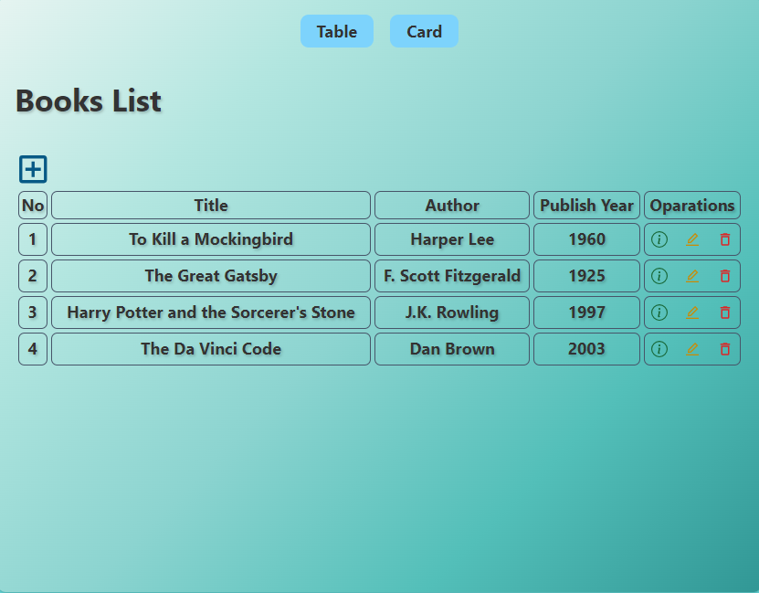
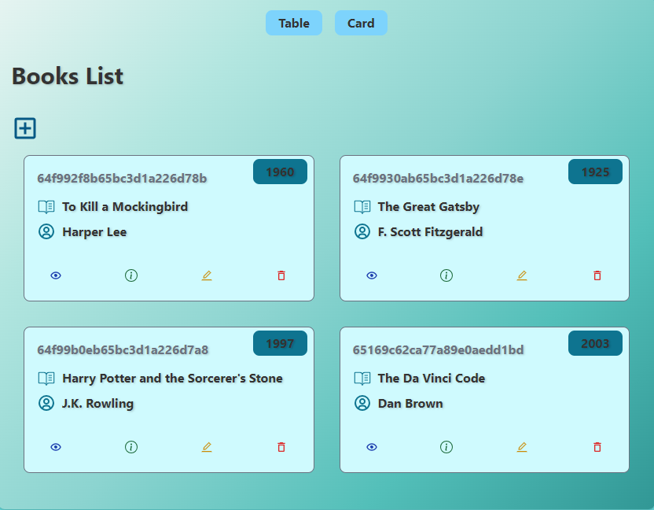

# MERN Stack Book Store CRUD Application

Welcome to the MERN Stack Book Store CRUD Application! This is a basic web application that allows you to perform CRUD operations on a collection of books. You can create, read, update, and delete books from the store.




> A comprehensive shopping management system built with Java.

---

## Project Images

Please check the `book-store-project-images` directory for additional project-related images and files.

...

## Table of Contents

- [Features](#features)
- [Technologies Used](#technologies-used)
- [Installation](#installation)

## Features

- Create new books with title, author, and description.
- View a list of all the books in the store.
- Update book information.
- Delete books from the store.

## Technologies Used

This app was built with the following technologies:

- **Frontend**:
  - React: A JavaScript library for building user interfaces.
  - Axios: A promise-based HTTP client for making API requests.
  - React Router: For handling client-side routing.
  - Tailwind CSS: A utility-first CSS framework for fast and responsive web development.
  
- **Backend**:
  - Node.js: A JavaScript runtime environment.
  - Express.js: A web application framework for Node.js.
  - MongoDB: A NoSQL database for storing book data.
  - Mongoose: A MongoDB object modeling tool.

## Installation

To run this application locally, follow these steps:

1. Clone this repository to your local machine:

   ```bash
   git clone https://github.com/Geethaka123/Simple-bookstore-CRUD-application.git
